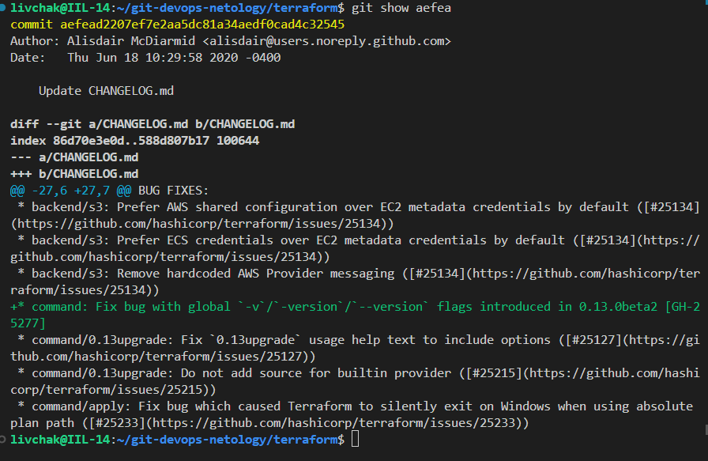
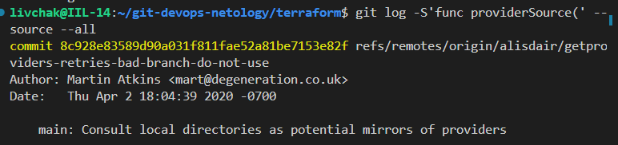

# git-instruments

---

### Задание 1

1. **git-instruments-1** 

---

### Задание 2

`Ответьте на вопросы.`

1. `Какому тегу соответствует коммит 85024d3.`
    commit 85024d3100126de36331c6982bfaac02cdab9e76 (tag: v0.12.23)
2. `Сколько родителей у коммита b8d720? Напишите их хеши.`
    git cat-file -p b8d720 
    parent 56cd7859e05c36c06b56d013b55a252d0bb7e158
    parent 9ea88f22fc6269854151c571162c5bcf958bee2b
3. `Перечислите хеши и комментарии всех коммитов, которые были сделаны между тегами v0.12.23 и v0.12.24.`
    git log v0.12.23..v0.12.24 --oneline
    33ff1c03bb (tag: v0.12.24) v0.12.24
    b14b74c493 [Website] vmc provider links
    3f235065b9 Update CHANGELOG.md
    6ae64e247b registry: Fix panic when server is unreachable
    5c619ca1ba website: Remove links to the getting started guide's old location
    06275647e2 Update CHANGELOG.md
    d5f9411f51 command: Fix bug when using terraform login on Windows
    4b6d06cc5d Update CHANGELOG.md
    dd01a35078 Update CHANGELOG.md
    225466bc3e Cleanup after v0.12.23 release

4. `Найдите коммит, в котором была создана функция func providerSource, её определение в коде выглядит так: func providerSource(...) (вместо троеточия перечислены аргументы)`

**git-instruments-1** 

5. `Найдите все коммиты, в которых была изменена функция globalPluginDirs` 
коммандой git grep globalPluginDirs мы ищем в каких файлах была упомянута функция
файл plugins.go был изменён в следующих коммитах
    commit 8364383c359a6b738a436d1b7745ccdce178df47
    commit 66ebff90cdfaa6938f26f908c7ebad8d547fea17
    commit 41ab0aef7a0fe030e84018973a64135b11abcd70
    commit 52dbf94834cb970b510f2fba853a5b49ad9b1a46
    commit 78b12205587fe839f10d946ea3fdc06719decb05

6. `Кто автор функции synchronizedWriters?`
выполняем поиск git log -S'synchronizedWriters' --source --all
а затем смотрим каждый коммит на предмет добавления фунции

commit 5ac311e2a91e381e2f52234668b49ba670aa0fe5
Author: Martin Atkins <mart@degeneration.co.uk>
Date:   Wed May 3 16:25:41 2017 -0700

